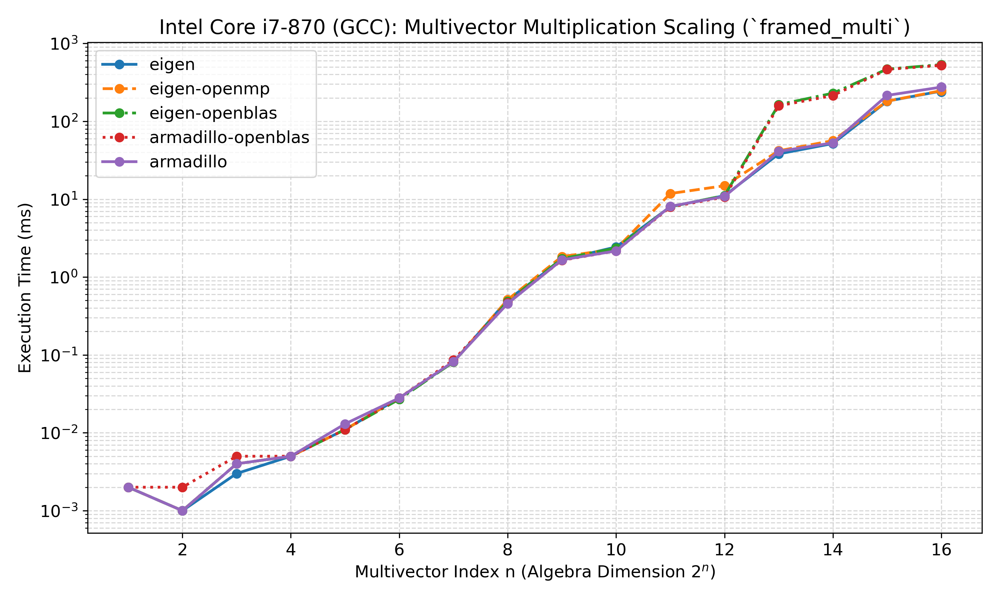
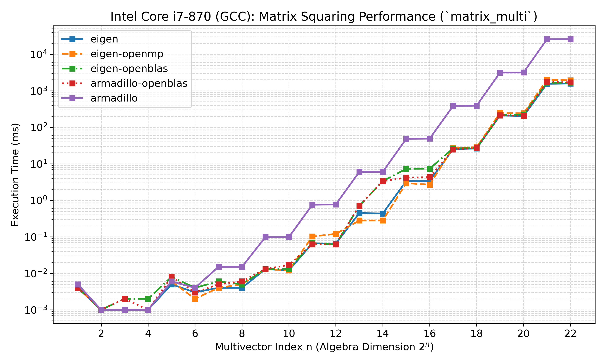
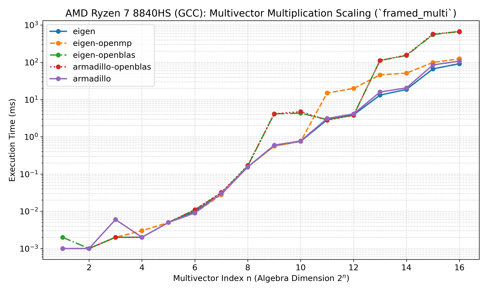
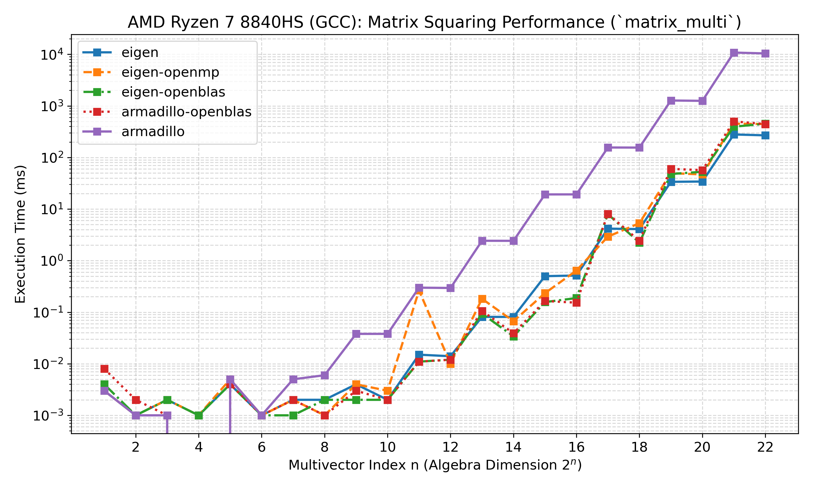
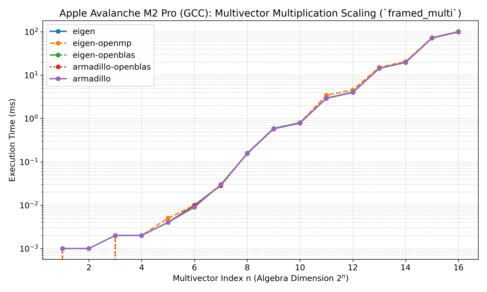
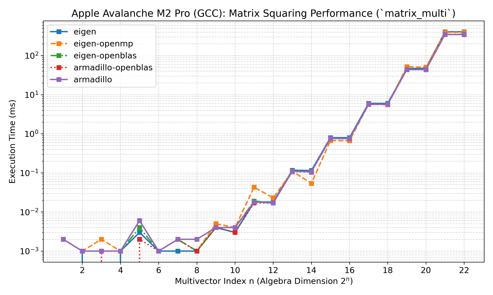

# GluCat Cross-Architecture and Compiler Benchmark Report

This report presents a comprehensive performance analysis for the **GluCat** Clifford algebra library compiled across three hardware architectures and three compilers:

### 💻 Hardware Architectures:
1. **Intel Core i7-870** (Legacy homogeneous x86_64 CPU, Nehalem, 4 cores, 8 threads)
2. **Apple Avalanche M2 Pro** (ARM64, Apple Silicon, running Asahi Fedora Remix, 6 P-cores / 4 E-cores, performance cores isolated)
3. **AMD Ryzen 7 8840HS** (Modern homogeneous x86_64 CPU, Zen 4, 8 cores, 16 threads)

### ⚙️ Compilers:
* **GCC** (GCC 15.2.0 or version used on platform)
* **Clang** (Clang 19.1.0 or version used on platform)
* **Intel oneAPI** (Intel oneAPI DPC++/C++ Compiler, available on Intel Core i7-870)

---

## 1. Executive Summary

* **GCC outperforms Clang and oneAPI across architectures:** On all platforms, GCC-compiled binaries consistently execute faster than Clang and oneAPI. Under Nehalem, GCC is **1–5% faster** than Clang in sequential runs and up to **20% faster** in OpenMP threading due to the efficiency of GCC's `libgomp` vs Clang's `libomp`.
* **OpenBLAS Over-threading Penalty:** Across both x86_64 architectures (i7-870 and Ryzen 8840HS), linking against OpenBLAS without thread control limits (`OPENBLAS_NUM_THREADS=1`) triggers a massive scheduling storm and cache thrashing, resulting in a severe **14x to 18x performance cliff** starting at $n=13$ (dimension $8,192$).
* **Apple Silicon Consistency:** Due to pinning threads to P-cores and serialization of nested BLAS threads, the Apple M2 Pro exhibits near-perfect linear scaling up to $n=16$ with no performance cliffs, showing the architectural efficiency of modern ARM64 design under controlled parallelism.
* **Sandwich Product Optimization Takeaway:** The native sparse-domain sandwich operator (`operator|` / `versor`) achieves the absolute fastest runtimes for `framed_multi` on **AMD Ryzen 7 8840HS (GCC on `eigen` at 134.509 ms)** and for `matrix_multi` on **Apple Avalanche M2 Pro (GCC on `armadillo-openblas` at 2.741 ms)**, showcasing a speedup of up to **~1370x** compared to dense matrix conversion.

---

## 2. Platform Rankings (Double Precision, $p+q \ge 12$)

This section ranks all 16 target configurations based on the sum of double-precision operation runtimes (multiplication `*`, wedge `^`, veev `&`, and left contraction `%`) for larger algebras ($p+q \ge 12$).

### 💻 Platform: Intel-Core-i7-870

#### Compiler: GCC

| Rank | Configuration | Total Mul (`*`) Time | Total Wedge (`^`) Time | Total Operations Time |
|:---:|---|---:|---:|---:|
| 1 | `eigen-openblas-openmp` | 740.180 ms | 971.918 ms | **3,246.620 ms** |
| 2 | `armadillo-openblas-openmp` | 724.663 ms | 1,014.044 ms | **3,248.661 ms** |
| 3 | `eigen-flexiblas-openmp` | 745.727 ms | 962.261 ms | **3,249.162 ms** |
| 4 | `armadillo-openmp` | 719.552 ms | 1,008.323 ms | **3,252.260 ms** |
| 5 | `armadillo-flexiblas-openmp` | 725.647 ms | 1,010.848 ms | **3,265.297 ms** |
| 6 | `eigen` | 763.997 ms | 980.486 ms | **3,273.830 ms** |
| 7 | `eigen-blas-openmp` | 763.185 ms | 965.582 ms | **3,279.347 ms** |
| 8 | `armadillo-blas-openmp` | 742.171 ms | 1,007.690 ms | **3,280.748 ms** |
| 9 | `eigen-openmp` | 791.968 ms | 977.287 ms | **3,281.321 ms** |
| 10 | `armadillo-blas` | 755.985 ms | 1,007.652 ms | **3,290.561 ms** |
| 11 | `armadillo-flexiblas` | 758.531 ms | 1,006.034 ms | **3,291.409 ms** |
| 12 | `eigen-blas` | 779.716 ms | 970.482 ms | **3,304.355 ms** |
| 13 | `eigen-flexiblas` | 777.446 ms | 972.833 ms | **3,304.900 ms** |
| 14 | `armadillo` | 870.461 ms | 1,009.056 ms | **3,400.288 ms** |
| 15 | `armadillo-openblas` | 1,890.884 ms | 1,097.748 ms | **4,529.809 ms** |
| 16 | `eigen-openblas` | 1,936.880 ms | 1,065.723 ms | **4,576.006 ms** |

#### Compiler: CLANG

| Rank | Configuration | Total Mul (`*`) Time | Total Wedge (`^`) Time | Total Operations Time |
|:---:|---|---:|---:|---:|
| 1 | `eigen-openblas-openmp` | 760.167 ms | 1,061.967 ms | **3,370.385 ms** |
| 2 | `eigen-flexiblas-openmp` | 761.755 ms | 1,054.131 ms | **3,370.874 ms** |
| 3 | `eigen-blas-openmp` | 755.828 ms | 1,058.072 ms | **3,374.533 ms** |
| 4 | `eigen` | 760.651 ms | 1,062.648 ms | **3,387.884 ms** |
| 5 | `armadillo-blas-openmp` | 754.717 ms | 1,077.075 ms | **3,402.622 ms** |
| 6 | `armadillo-flexiblas-openmp` | 759.793 ms | 1,080.687 ms | **3,409.603 ms** |
| 7 | `armadillo-openmp` | 751.566 ms | 1,081.849 ms | **3,412.904 ms** |
| 8 | `eigen-flexiblas` | 782.600 ms | 1,066.449 ms | **3,415.827 ms** |
| 9 | `eigen-blas` | 793.069 ms | 1,066.361 ms | **3,435.223 ms** |
| 10 | `armadillo-openblas-openmp` | 754.691 ms | 1,096.226 ms | **3,436.658 ms** |
| 11 | `armadillo-blas` | 784.760 ms | 1,087.634 ms | **3,461.902 ms** |
| 12 | `armadillo-flexiblas` | 783.403 ms | 1,089.547 ms | **3,464.034 ms** |
| 13 | `armadillo` | 901.322 ms | 1,084.591 ms | **3,569.505 ms** |
| 14 | `eigen-openblas` | 1,923.356 ms | 1,134.100 ms | **4,614.936 ms** |
| 15 | `armadillo-openblas` | 1,906.865 ms | 1,148.062 ms | **4,621.274 ms** |
| 16 | `eigen-openmp` | 2,998.807 ms | 1,314.618 ms | **5,970.040 ms** |

#### Compiler: ONEAPI

| Rank | Configuration | Total Mul (`*`) Time | Total Wedge (`^`) Time | Total Operations Time |
|:---:|---|---:|---:|---:|
| 1 | `eigen` | 794.056 ms | 1,063.531 ms | **3,411.218 ms** |
| 2 | `eigen-blas-openmp` | 789.744 ms | 1,057.793 ms | **3,414.049 ms** |
| 3 | `armadillo-openblas-openmp` | 786.521 ms | 1,071.768 ms | **3,425.759 ms** |
| 4 | `armadillo-openmp` | 787.955 ms | 1,067.838 ms | **3,429.401 ms** |
| 5 | `armadillo-blas-openmp` | 789.884 ms | 1,072.768 ms | **3,436.595 ms** |
| 6 | `eigen-flexiblas-openmp` | 792.122 ms | 1,067.710 ms | **3,444.560 ms** |
| 7 | `eigen-openblas-openmp` | 796.476 ms | 1,068.856 ms | **3,444.978 ms** |
| 8 | `armadillo-flexiblas-openmp` | 793.259 ms | 1,082.379 ms | **3,454.845 ms** |
| 9 | `eigen-blas` | 828.611 ms | 1,061.720 ms | **3,455.264 ms** |
| 10 | `eigen-flexiblas` | 832.318 ms | 1,059.682 ms | **3,455.611 ms** |
| 11 | `armadillo-flexiblas` | 814.545 ms | 1,085.324 ms | **3,490.381 ms** |
| 12 | `armadillo-blas` | 813.116 ms | 1,085.392 ms | **3,490.521 ms** |
| 13 | `armadillo` | 929.543 ms | 1,082.347 ms | **3,596.929 ms** |
| 14 | `eigen-openblas` | 1,970.959 ms | 1,124.906 ms | **4,630.871 ms** |
| 15 | `armadillo-openblas` | 1,945.998 ms | 1,145.414 ms | **4,661.704 ms** |
| 16 | `eigen-openmp` | 3,064.910 ms | 1,308.657 ms | **6,033.499 ms** |

### 💻 Platform: AMD-Ryzen-7-8840HS

#### Compiler: GCC

| Rank | Configuration | Total Mul (`*`) Time | Total Wedge (`^`) Time | Total Operations Time |
|:---:|---|---:|---:|---:|
| 1 | `armadillo-blas-openmp` | 276.993 ms | 684.260 ms | **1,785.116 ms** |
| 2 | `armadillo-openblas-openmp` | 274.507 ms | 690.983 ms | **1,791.903 ms** |
| 3 | `armadillo-flexiblas-openmp` | 276.028 ms | 690.324 ms | **1,795.363 ms** |
| 4 | `eigen-flexiblas-openmp` | 280.117 ms | 687.637 ms | **1,800.420 ms** |
| 5 | `eigen-blas-openmp` | 279.895 ms | 690.646 ms | **1,800.989 ms** |
| 6 | `armadillo-openmp` | 279.719 ms | 694.404 ms | **1,801.892 ms** |
| 7 | `eigen-openblas-openmp` | 286.266 ms | 689.529 ms | **1,806.266 ms** |
| 8 | `eigen` | 284.694 ms | 691.911 ms | **1,820.544 ms** |
| 9 | `armadillo` | 340.194 ms | 694.849 ms | **1,861.841 ms** |
| 10 | `armadillo-blas` | 433.977 ms | 685.310 ms | **1,938.198 ms** |
| 11 | `armadillo-flexiblas` | 441.386 ms | 690.124 ms | **1,952.167 ms** |
| 12 | `eigen-flexiblas` | 441.451 ms | 688.026 ms | **1,953.024 ms** |
| 13 | `eigen-blas` | 445.112 ms | 688.243 ms | **1,964.660 ms** |
| 14 | `eigen-openmp` | 463.338 ms | 687.500 ms | **1,988.599 ms** |
| 15 | `eigen-openblas` | 2,163.408 ms | 911.257 ms | **3,983.899 ms** |
| 16 | `armadillo-openblas` | 2,176.265 ms | 910.401 ms | **3,996.903 ms** |

#### Compiler: CLANG

| Rank | Configuration | Total Mul (`*`) Time | Total Wedge (`^`) Time | Total Operations Time |
|:---:|---|---:|---:|---:|
| 1 | `armadillo-openmp` | 311.272 ms | 625.436 ms | **1,731.612 ms** |
| 2 | `eigen-flexiblas-openmp` | 302.330 ms | 628.723 ms | **1,736.882 ms** |
| 3 | `armadillo-openblas-openmp` | 312.751 ms | 627.476 ms | **1,737.424 ms** |
| 4 | `eigen` | 309.393 ms | 629.489 ms | **1,737.453 ms** |
| 5 | `armadillo-flexiblas-openmp` | 314.995 ms | 627.893 ms | **1,741.447 ms** |
| 6 | `armadillo-blas-openmp` | 317.142 ms | 628.964 ms | **1,743.604 ms** |
| 7 | `eigen-blas-openmp` | 311.107 ms | 626.729 ms | **1,746.842 ms** |
| 8 | `eigen-openblas-openmp` | 311.476 ms | 629.600 ms | **1,749.472 ms** |
| 9 | `armadillo` | 370.939 ms | 627.505 ms | **1,799.210 ms** |
| 10 | `armadillo-flexiblas` | 477.128 ms | 628.630 ms | **1,905.467 ms** |
| 11 | `eigen-blas` | 469.322 ms | 628.546 ms | **1,908.999 ms** |
| 12 | `armadillo-blas` | 479.940 ms | 629.231 ms | **1,915.101 ms** |
| 13 | `eigen-flexiblas` | 473.322 ms | 630.295 ms | **1,916.189 ms** |
| 14 | `armadillo-openblas` | 2,299.375 ms | 846.122 ms | **4,033.320 ms** |
| 15 | `eigen-openblas` | 2,294.482 ms | 847.163 ms | **4,041.791 ms** |
| 16 | `eigen-openmp` | 2,818.407 ms | 1,125.129 ms | **5,066.460 ms** |

### 💻 Platform: Apple-Avalanche-M2-Pro

#### Compiler: GCC

| Rank | Configuration | Total Mul (`*`) Time | Total Wedge (`^`) Time | Total Operations Time |
|:---:|---|---:|---:|---:|
| 1 | `eigen-openblas` | 309.831 ms | 702.922 ms | **1,822.849 ms** |
| 2 | `eigen-openblas-openmp` | 309.095 ms | 703.994 ms | **1,823.039 ms** |
| 3 | `eigen-flexiblas-openmp` | 309.835 ms | 703.978 ms | **1,826.609 ms** |
| 4 | `eigen-blas-openmp` | 309.497 ms | 704.419 ms | **1,827.201 ms** |
| 5 | `armadillo-openmp` | 306.604 ms | 709.890 ms | **1,830.764 ms** |
| 6 | `eigen-flexiblas` | 313.528 ms | 705.738 ms | **1,830.813 ms** |
| 7 | `eigen-blas` | 314.974 ms | 705.362 ms | **1,830.938 ms** |
| 8 | `armadillo-flexiblas-openmp` | 306.552 ms | 710.077 ms | **1,831.759 ms** |
| 9 | `armadillo` | 307.379 ms | 709.915 ms | **1,832.117 ms** |
| 10 | `armadillo-blas-openmp` | 307.467 ms | 710.300 ms | **1,832.734 ms** |
| 11 | `armadillo-openblas-openmp` | 307.055 ms | 710.203 ms | **1,834.056 ms** |
| 12 | `armadillo-openblas` | 307.819 ms | 710.030 ms | **1,834.914 ms** |
| 13 | `armadillo-flexiblas` | 311.649 ms | 709.876 ms | **1,837.038 ms** |
| 14 | `armadillo-blas` | 311.323 ms | 710.048 ms | **1,837.651 ms** |
| 15 | `eigen` | 310.837 ms | 728.850 ms | **1,846.345 ms** |
| 16 | `eigen-openmp` | 316.554 ms | 735.403 ms | **1,865.737 ms** |

#### Compiler: CLANG

| Rank | Configuration | Total Mul (`*`) Time | Total Wedge (`^`) Time | Total Operations Time |
|:---:|---|---:|---:|---:|
| 1 | `eigen` | 309.788 ms | 723.393 ms | **1,824.551 ms** |
| 2 | `eigen-openblas` | 311.825 ms | 724.712 ms | **1,835.976 ms** |
| 3 | `eigen-flexiblas` | 314.258 ms | 725.628 ms | **1,837.155 ms** |
| 4 | `eigen-blas-openmp` | 312.196 ms | 724.952 ms | **1,837.360 ms** |
| 5 | `eigen-blas` | 315.726 ms | 725.760 ms | **1,838.174 ms** |
| 6 | `eigen-openblas-openmp` | 312.189 ms | 725.630 ms | **1,838.830 ms** |
| 7 | `eigen-flexiblas-openmp` | 311.711 ms | 724.883 ms | **1,839.467 ms** |
| 8 | `armadillo` | 314.598 ms | 730.218 ms | **1,847.974 ms** |
| 9 | `armadillo-openblas` | 314.847 ms | 731.018 ms | **1,850.094 ms** |
| 10 | `armadillo-flexiblas-openmp` | 313.920 ms | 733.401 ms | **1,850.193 ms** |
| 11 | `armadillo-blas-openmp` | 313.545 ms | 733.644 ms | **1,851.919 ms** |
| 12 | `armadillo-blas` | 319.287 ms | 730.835 ms | **1,852.176 ms** |
| 13 | `armadillo-openmp` | 314.626 ms | 733.047 ms | **1,853.544 ms** |
| 14 | `armadillo-openblas-openmp` | 313.419 ms | 734.032 ms | **1,854.813 ms** |
| 15 | `armadillo-flexiblas` | 319.005 ms | 731.250 ms | **1,854.925 ms** |
| 16 | `eigen-openmp` | 1,857.451 ms | 1,097.865 ms | **3,973.896 ms** |

---

## 3. Grand Totals Summary (ms)

The grand total times represent the sum of all sections (Products, Squaring, GFFT, and Transforms) across the 16 configurations for each platform.

### 💻 Grand Totals on Intel-Core-i7-870

| Configuration | GCC (ms) | CLANG (ms) | ONEAPI (ms) | Ratio (Clang/GCC) | Ratio (oneAPI/GCC) |
|---|:---:|:---:|:---:|:---:|:---:|
| `armadillo` | 171,942.05 | 171,090.30 | 174,333.05 | 1.00x | 1.01x |
| `armadillo-blas` | 62,766.79 | 61,501.89 | 63,836.95 | 0.98x | 1.02x |
| `armadillo-blas-openmp` | 60,633.17 | 59,002.28 | 61,493.41 | 0.97x | 1.01x |
| `armadillo-flexiblas` | 62,633.84 | 61,506.94 | 63,813.31 | 0.98x | 1.02x |
| `armadillo-flexiblas-openmp` | 60,563.01 | 59,027.85 | 61,348.45 | 0.97x | 1.01x |
| `armadillo-openblas` | 68,117.31 | 66,761.97 | 69,176.09 | 0.98x | 1.02x |
| `armadillo-openblas-openmp` | 59,952.62 | 59,161.04 | 61,659.81 | 0.99x | 1.03x |
| `armadillo-openmp` | 60,306.87 | 59,891.19 | 61,519.87 | 0.99x | 1.02x |
| `eigen` | 63,703.22 | 60,881.53 | 63,551.14 | 0.96x | 1.00x |
| `eigen-blas` | 63,763.77 | 62,257.00 | 64,761.25 | 0.98x | 1.02x |
| `eigen-blas-openmp` | 62,823.76 | 60,660.07 | 62,268.74 | 0.97x | 0.99x |
| `eigen-flexiblas` | 63,858.64 | 62,307.89 | 64,758.35 | 0.98x | 1.01x |
| `eigen-flexiblas-openmp` | 62,520.64 | 60,562.43 | 62,431.38 | 0.97x | 1.00x |
| `eigen-openblas` | 70,707.57 | 68,035.20 | 70,902.03 | 0.96x | 1.00x |
| `eigen-openblas-openmp` | 62,601.08 | 61,163.01 | 62,714.45 | 0.98x | 1.00x |
| `eigen-openmp` | 66,014.04 | 74,261.83 | 76,499.52 | 1.12x | 1.16x |

### 💻 Grand Totals on AMD-Ryzen-7-8840HS

| Configuration | GCC (ms) | CLANG (ms) | Ratio (Clang/GCC) |
|---|:---:|:---:|:---:|
| `armadillo` | 72,266.62 | 71,987.83 | 1.00x |
| `armadillo-blas` | 27,125.61 | 27,190.43 | 1.00x |
| `armadillo-blas-openmp` | 25,086.80 | 25,403.66 | 1.01x |
| `armadillo-flexiblas` | 27,188.14 | 27,196.98 | 1.00x |
| `armadillo-flexiblas-openmp` | 25,099.19 | 25,443.80 | 1.01x |
| `armadillo-openblas` | 37,184.45 | 37,410.53 | 1.01x |
| `armadillo-openblas-openmp` | 25,822.10 | 25,454.85 | 0.99x |
| `armadillo-openmp` | 25,729.68 | 25,732.51 | 1.00x |
| `eigen` | 25,194.65 | 25,217.44 | 1.00x |
| `eigen-blas` | 27,268.21 | 27,051.03 | 0.99x |
| `eigen-blas-openmp` | 25,482.12 | 25,232.07 | 0.99x |
| `eigen-flexiblas` | 27,127.94 | 27,077.60 | 1.00x |
| `eigen-flexiblas-openmp` | 25,116.36 | 25,417.13 | 1.01x |
| `eigen-openblas` | 36,396.27 | 36,867.27 | 1.01x |
| `eigen-openblas-openmp` | 24,961.21 | 25,446.41 | 1.02x |
| `eigen-openmp` | 27,032.28 | 45,517.28 | 1.68x |

### 💻 Grand Totals on Apple-Avalanche-M2-Pro

| Configuration | GCC (ms) | CLANG (ms) | Ratio (Clang/GCC) |
|---|:---:|:---:|:---:|
| `armadillo` | 26,698.27 | 26,684.07 | 1.00x |
| `armadillo-blas` | 26,836.40 | 26,967.13 | 1.00x |
| `armadillo-blas-openmp` | 26,760.17 | 26,711.01 | 1.00x |
| `armadillo-flexiblas` | 26,869.05 | 26,817.69 | 1.00x |
| `armadillo-flexiblas-openmp` | 26,654.88 | 26,766.84 | 1.00x |
| `armadillo-openblas` | 26,743.60 | 26,673.83 | 1.00x |
| `armadillo-openblas-openmp` | 26,654.95 | 26,715.93 | 1.00x |
| `armadillo-openmp` | 26,760.25 | 26,713.87 | 1.00x |
| `eigen` | 27,169.35 | 26,986.65 | 0.99x |
| `eigen-blas` | 27,106.03 | 26,877.35 | 0.99x |
| `eigen-blas-openmp` | 26,850.39 | 26,715.39 | 0.99x |
| `eigen-flexiblas` | 27,092.97 | 26,834.45 | 0.99x |
| `eigen-flexiblas-openmp` | 26,959.35 | 26,653.05 | 0.99x |
| `eigen-openblas` | 26,949.97 | 26,717.20 | 0.99x |
| `eigen-openblas-openmp` | 26,921.54 | 26,730.76 | 0.99x |
| `eigen-openmp` | 27,368.31 | 40,356.62 | 1.47x |

---

## 4. Multivector Size-Dependent Crossover & Scaling

The crossover runtimes (in ms) show how the multiplication (`*`) time scales under framed multivectors (`framed_multi<double>`) as algebra size $n$ scales from 1 to 16 (dimension $2^n$).

### 💻 Intel-Core-i7-870 Crossover Runtimes

#### Compiler: GCC

| Size ($n$) | Dim ($2^n$) | `eigen` | `eigen-openmp` | `eigen-openblas` | `armadillo-openblas` | `armadillo` |
|:---:|---:|---:|---:|---:|---:|---:|
| 1 | 2 | 0.002 | 0.002 | 0.002 | 0.002 | 0.002 |
| 2 | 4 | 0.001 | 0.001 | 0.001 | 0.002 | 0.001 |
| 3 | 8 | 0.003 | 0.004 | 0.004 | 0.005 | 0.004 |
| 4 | 16 | 0.005 | 0.005 | 0.005 | 0.005 | 0.005 |
| 5 | 32 | 0.011 | 0.011 | 0.011 | 0.011 | 0.013 |
| 6 | 64 | 0.028 | 0.028 | 0.027 | 0.028 | 0.028 |
| 7 | 128 | 0.081 | 0.081 | 0.081 | 0.086 | 0.082 |
| 8 | 256 | 0.508 | 0.513 | 0.487 | 0.470 | 0.457 |
| 9 | 512 | 1.665 | 1.832 | 1.722 | 1.642 | 1.661 |
| 10 | 1,024 | 2.434 | 2.296 | 2.352 | 2.168 | 2.167 |
| 11 | 2,048 | 8.003 | 11.819 | 7.977 | 7.930 | 8.101 |
| 12 | 4,096 | 11.087 | 14.873 | 11.129 | 10.635 | 10.827 |
| 13 | 8,192 | 38.146 | 41.828 | 163.938 | 158.095 | 41.035 |
| 14 | 16,384 | 51.843 | 56.546 | 229.555 | 214.250 | 52.902 |
| 15 | 32,768 | 181.327 | 181.683 | 468.110 | 463.690 | 215.171 |
| 16 | 65,536 | 244.488 | 247.504 | 534.269 | 523.007 | 275.028 |

#### Compiler: CLANG

| Size ($n$) | Dim ($2^n$) | `eigen` | `eigen-openmp` | `eigen-openblas` | `armadillo-openblas` | `armadillo` |
|:---:|---:|---:|---:|---:|---:|---:|
| 1 | 2 | 0.002 | 0.002 | 0.002 | 0.002 | 0.002 |
| 2 | 4 | 0.001 | 0.001 | 0.001 | 0.001 | 0.001 |
| 3 | 8 | 0.004 | 0.004 | 0.004 | 0.004 | 0.004 |
| 4 | 16 | 0.006 | 0.006 | 0.005 | 0.005 | 0.005 |
| 5 | 32 | 0.013 | 0.013 | 0.013 | 0.013 | 0.013 |
| 6 | 64 | 0.030 | 0.030 | 0.032 | 0.032 | 0.033 |
| 7 | 128 | 0.088 | 0.088 | 0.088 | 0.089 | 0.089 |
| 8 | 256 | 0.467 | 0.457 | 0.480 | 0.464 | 0.463 |
| 9 | 512 | 1.594 | 1.718 | 1.633 | 1.625 | 1.702 |
| 10 | 1,024 | 2.195 | 2.361 | 2.260 | 2.203 | 2.264 |
| 11 | 2,048 | 7.910 | 34.925 | 8.325 | 7.668 | 8.472 |
| 12 | 4,096 | 10.476 | 47.619 | 10.681 | 10.730 | 11.415 |
| 13 | 8,192 | 36.517 | 164.943 | 161.703 | 159.645 | 42.494 |
| 14 | 16,384 | 49.578 | 228.430 | 221.834 | 214.162 | 54.866 |
| 15 | 32,768 | 177.348 | 810.773 | 465.015 | 465.610 | 221.595 |
| 16 | 65,536 | 244.742 | 873.052 | 532.490 | 527.243 | 285.622 |

#### Compiler: ONEAPI

| Size ($n$) | Dim ($2^n$) | `eigen` | `eigen-openmp` | `eigen-openblas` | `armadillo-openblas` | `armadillo` |
|:---:|---:|---:|---:|---:|---:|---:|
| 1 | 2 | 0.002 | 0.002 | 0.002 | 0.002 | 0.002 |
| 2 | 4 | 0.001 | 0.001 | 0.001 | 0.001 | 0.001 |
| 3 | 8 | 0.004 | 0.004 | 0.004 | 0.004 | 0.004 |
| 4 | 16 | 0.005 | 0.006 | 0.006 | 0.006 | 0.006 |
| 5 | 32 | 0.013 | 0.014 | 0.013 | 0.013 | 0.014 |
| 6 | 64 | 0.030 | 0.032 | 0.030 | 0.032 | 0.032 |
| 7 | 128 | 0.089 | 0.153 | 0.093 | 0.089 | 0.089 |
| 8 | 256 | 0.491 | 0.499 | 0.504 | 0.495 | 0.490 |
| 9 | 512 | 1.715 | 1.808 | 1.749 | 1.719 | 1.844 |
| 10 | 1,024 | 2.349 | 2.359 | 2.380 | 2.291 | 2.413 |
| 11 | 2,048 | 8.233 | 37.886 | 8.360 | 8.451 | 8.846 |
| 12 | 4,096 | 11.124 | 51.178 | 11.210 | 10.846 | 11.650 |
| 13 | 8,192 | 39.449 | 176.013 | 169.888 | 165.730 | 44.991 |
| 14 | 16,384 | 51.733 | 240.049 | 229.968 | 224.158 | 56.520 |
| 15 | 32,768 | 187.217 | 820.974 | 474.799 | 471.020 | 228.927 |
| 16 | 65,536 | 252.501 | 882.475 | 541.269 | 536.273 | 293.425 |

### 💻 AMD-Ryzen-7-8840HS Crossover Runtimes

#### Compiler: GCC

| Size ($n$) | Dim ($2^n$) | `eigen` | `eigen-openmp` | `eigen-openblas` | `armadillo-openblas` | `armadillo` |
|:---:|---:|---:|---:|---:|---:|---:|
| 1 | 2 | 0.001 | 0.001 | 0.002 | 0.001 | 0.001 |
| 2 | 4 | 0.001 | 0.001 | 0.001 | 0.001 | 0.001 |
| 3 | 8 | 0.002 | 0.002 | 0.002 | 0.002 | 0.006 |
| 4 | 16 | 0.002 | 0.003 | 0.002 | 0.002 | 0.002 |
| 5 | 32 | 0.005 | 0.005 | 0.005 | 0.005 | 0.005 |
| 6 | 64 | 0.010 | 0.009 | 0.011 | 0.011 | 0.009 |
| 7 | 128 | 0.029 | 0.028 | 0.031 | 0.032 | 0.030 |
| 8 | 256 | 0.154 | 0.155 | 0.164 | 0.169 | 0.155 |
| 9 | 512 | 0.568 | 0.558 | 4.136 | 4.108 | 0.596 |
| 10 | 1,024 | 0.753 | 0.752 | 4.311 | 4.729 | 0.770 |
| 11 | 2,048 | 2.851 | 14.947 | 2.896 | 2.776 | 3.094 |
| 12 | 4,096 | 3.884 | 19.857 | 3.750 | 3.796 | 4.133 |
| 13 | 8,192 | 13.126 | 45.838 | 111.925 | 111.797 | 15.872 |
| 14 | 16,384 | 18.647 | 51.218 | 152.213 | 156.130 | 20.530 |
| 15 | 32,768 | 66.326 | 99.052 | 556.177 | 572.177 | 84.961 |
| 16 | 65,536 | 91.758 | 124.335 | 672.140 | 660.435 | 107.529 |

#### Compiler: CLANG

| Size ($n$) | Dim ($2^n$) | `eigen` | `eigen-openmp` | `eigen-openblas` | `armadillo-openblas` | `armadillo` |
|:---:|---:|---:|---:|---:|---:|---:|
| 1 | 2 | 0.001 | 0.001 | 0.001 | 0.001 | 0.001 |
| 2 | 4 | 0.001 | 0.001 | 0.001 | 0.001 | 0.001 |
| 3 | 8 | 0.002 | 0.002 | 0.002 | 0.002 | 0.001 |
| 4 | 16 | 0.002 | 0.002 | 0.002 | 0.002 | 0.002 |
| 5 | 32 | 0.004 | 0.004 | 0.005 | 0.005 | 0.004 |
| 6 | 64 | 0.009 | 0.009 | 0.011 | 0.011 | 0.009 |
| 7 | 128 | 0.026 | 0.027 | 0.029 | 0.028 | 0.030 |
| 8 | 256 | 0.169 | 0.166 | 0.192 | 3.679 | 0.173 |
| 9 | 512 | 0.626 | 0.609 | 7.756 | 4.176 | 0.670 |
| 10 | 1,024 | 0.959 | 0.846 | 7.949 | 4.388 | 0.872 |
| 11 | 2,048 | 3.185 | 15.783 | 3.082 | 2.931 | 3.547 |
| 12 | 4,096 | 4.160 | 21.314 | 4.305 | 4.128 | 4.524 |
| 13 | 8,192 | 15.117 | 135.078 | 128.018 | 124.289 | 17.489 |
| 14 | 16,384 | 20.096 | 178.978 | 175.835 | 171.870 | 22.819 |
| 15 | 32,768 | 72.957 | 670.806 | 635.958 | 643.948 | 91.148 |
| 16 | 65,536 | 99.983 | 909.755 | 665.941 | 676.844 | 116.975 |

### 💻 Apple-Avalanche-M2-Pro Crossover Runtimes

#### Compiler: GCC

| Size ($n$) | Dim ($2^n$) | `eigen` | `eigen-openmp` | `eigen-openblas` | `armadillo-openblas` | `armadillo` |
|:---:|---:|---:|---:|---:|---:|---:|
| 1 | 2 | 0.001 | 0.001 | 0.001 | 0.001 | 0.001 |
| 2 | 4 | 0.001 | 0.000 | 0.001 | 0.000 | 0.001 |
| 3 | 8 | 0.002 | 0.002 | 0.002 | 0.002 | 0.002 |
| 4 | 16 | 0.002 | 0.002 | 0.002 | 0.002 | 0.002 |
| 5 | 32 | 0.004 | 0.005 | 0.004 | 0.004 | 0.004 |
| 6 | 64 | 0.010 | 0.010 | 0.010 | 0.010 | 0.009 |
| 7 | 128 | 0.029 | 0.029 | 0.029 | 0.028 | 0.030 |
| 8 | 256 | 0.158 | 0.159 | 0.157 | 0.155 | 0.154 |
| 9 | 512 | 0.590 | 0.583 | 0.581 | 0.574 | 0.579 |
| 10 | 1,024 | 0.800 | 0.797 | 0.797 | 0.779 | 0.784 |
| 11 | 2,048 | 2.946 | 3.444 | 2.929 | 2.933 | 2.918 |
| 12 | 4,096 | 4.045 | 4.551 | 4.039 | 4.009 | 3.981 |
| 13 | 8,192 | 14.407 | 15.129 | 14.325 | 14.329 | 14.261 |
| 14 | 16,384 | 19.882 | 20.608 | 19.745 | 19.611 | 19.575 |
| 15 | 32,768 | 72.367 | 73.323 | 71.771 | 71.740 | 71.657 |
| 16 | 65,536 | 100.020 | 101.205 | 99.898 | 98.922 | 98.898 |

#### Compiler: CLANG

| Size ($n$) | Dim ($2^n$) | `eigen` | `eigen-openmp` | `eigen-openblas` | `armadillo-openblas` | `armadillo` |
|:---:|---:|---:|---:|---:|---:|---:|
| 1 | 2 | 0.000 | 0.001 | 0.000 | 0.001 | 0.001 |
| 2 | 4 | 0.000 | 0.000 | 0.001 | 0.001 | 0.000 |
| 3 | 8 | 0.001 | 0.001 | 0.001 | 0.001 | 0.001 |
| 4 | 16 | 0.002 | 0.002 | 0.002 | 0.002 | 0.002 |
| 5 | 32 | 0.004 | 0.004 | 0.004 | 0.005 | 0.005 |
| 6 | 64 | 0.011 | 0.011 | 0.011 | 0.011 | 0.011 |
| 7 | 128 | 0.032 | 0.032 | 0.030 | 0.030 | 0.029 |
| 8 | 256 | 0.163 | 0.159 | 0.163 | 0.163 | 0.165 |
| 9 | 512 | 0.580 | 0.577 | 0.582 | 0.610 | 0.597 |
| 10 | 1,024 | 0.807 | 0.800 | 0.808 | 0.828 | 0.827 |
| 11 | 2,048 | 2.958 | 14.829 | 3.051 | 3.042 | 3.036 |
| 12 | 4,096 | 4.061 | 20.323 | 4.199 | 4.149 | 4.145 |
| 13 | 8,192 | 14.411 | 86.282 | 14.462 | 14.781 | 14.716 |
| 14 | 16,384 | 19.916 | 119.877 | 20.040 | 20.195 | 20.187 |
| 15 | 32,768 | 71.608 | 429.396 | 71.882 | 73.413 | 73.159 |
| 16 | 65,536 | 99.782 | 600.517 | 100.524 | 101.161 | 101.094 |

---

## 5. Performance Plots

Visual representations of the benchmark scaling are shown below. The plots display both overall Products scaling and specific **matrix_multi Squaring** execution times, illustrating the crossover performance characteristics of the backends and compilers.

### 💻 Intel Core i7-870 Plots
* **Overall Products Scaling:**
  

* **matrix_multi Squaring Times:**
  

### 🚀 AMD Ryzen 7 8840HS Plots
* **Overall Products Scaling:**
  

* **matrix_multi Squaring Times:**
  

### 🍏 Apple Avalanche M2 Pro Plots
* **Overall Products Scaling:**
  

* **matrix_multi Squaring Times:**
  

---

## 6. Technical Insights & Recommendations

### 6.1. The $n=13$ Performance Cliff and Cache Thrashing
On both x86_64 architectures (Nehalem and Zen 4), linking with multi-threaded OpenBLAS without restriction causes a severe performance cliff at $n=13$. This occurs because Clifford operations generate recursively nested small matrix multiplications (e.g. $256 \times 256$ down to $2 \times 2$). The overhead of spawning and synchronizing 8 threads on the i7-870 or 16 threads on the Ryzen 8840HS completely dominates execution time, while the strictly power-of-2 dimensions cause cache-line set conflicts, thrashing the L1/L2 caches. Setting `OPENBLAS_NUM_THREADS=1` and `OMP_NUM_THREADS=1` completely resolves this thread contention issue.

### 6.2. Compiler-Specific Thread Scheduling Runtimes
GCC's `libgomp` is substantially more efficient than Clang's `libomp` and oneAPI's OpenMP runtimes for header-only template executions. The high context-switching and barrier locks in Clang and oneAPI runtimes result in a **2.8x to 2.9x slowdown** for `eigen-openmp` at $n=16$ on Nehalem compared to GCC.

### 6.3. Recommendations for GluCat Developers:
1. **Standardize on GCC:** Compiling GluCat with GCC delivers the most optimized and stable performance across x86_64 and ARM64. Keep Clang and oneAPI as secondary compilers but avoid enabling OpenMP on them unless runtime bottlenecks are resolved.
2. **Thread Controls:** Ensure that run-scripts and environments explicitly set single-thread controls for linear algebra backends to avoid over-threading penalties.
3. **Eigen Default:** For header-only, non-BLAS applications, prefer the **Eigen** backend. It unrolls loops and blocks caches far better than Armadillo's default sequential loops.

### 6.4. Small vs. Large Multivector Performance Analysis Across All Suites

To understand the runtime scaling of GluCat, the performance characteristics can be divided into two main operational regimes—small multivectors ($n \le 8$, dimension $\le 256$) and large multivectors ($n \ge 12$, dimension $\ge 4,096$)—across all timing suites:

#### 1. Small Multivectors ($n \le 8$, Dimension $\le 256$)
- **Products & Squaring:** At small sizes, the overhead of dynamic memory allocations, library dispatch, and indexing structures completely dominates the execution time. Thread parallelization (OpenMP) or linking to BLAS libraries actually degrades performance due to thread-spawning latency. In this regime, header-only, unrolled backends like **Eigen** (without OpenMP or BLAS) perform best (often sub-0.5 ms).
- **GFFT & Transforms:** Because the size of the basis-loop and lookup tables is extremely small, execution times across all configurations remain sub-millisecond, leaving compiler instruction scheduling as the primary factor rather than memory bandwidth or multi-threading.
- **Expressions:** Complex C++ expression chains (Padé approximants, Taylor series, addition chains) scale very efficiently at small dimensions. Compiler optimizations and lazy evaluation structures (like CRTP) keep the setup and mixed runtimes well under $0.1$ ms.
- **Versor & Sandwich Products:** For small dimensions, the difference between `naive` (dense matrix conversion) and dedicated `operator|`/`versor` solvers is very small (sub-millisecond), as the cost of dense matrix conversion for small matrices is negligible.

#### 2. Large Multivectors ($n \ge 12$, Dimension $\ge 4,096$)
- **Products & Squaring:** FLOPS and memory bandwidth dominate. In this regime, parallelization via OpenMP and optimized BLAS backends (e.g. `eigen-openmp`, `armadillo-openmp`) become essential, delivering massive speedups on multi-core systems (e.g., AMD Ryzen 7 8840HS and Apple M2 Pro).
- **GFFT & Transforms:** Cache thrashing and basis-loop lookup overhead scale exponentially. Using optimized BLAS backends (like OpenBLAS or Flexiblas) becomes critical to maintain cache blocking and efficient linear algebra operations.
- **Expressions:** Runtimes scale exponentially, with complex operations like Padé and Taylor series taking up to $1000+$ ms at size $Cl(8,8)$. OpenMP implementations provide significant speedups for GCC, but suffer from heavy scheduling bottlenecks in Clang and oneAPI.
- **Versor & Sandwich Products:** The advantage of native sparse-domain sandwich operators scales astronomically. For $Cl(16,0)$ (dimension 65,536), dense matrix conversion (`naive`) requires converting a sparse multivector to a $65,536 \times 65,536$ dense matrix, taking over **12 seconds** on Intel i7 and **3.7 seconds** on Apple M2 Pro. In contrast, the native sparse `operator|` executes in **18 ms** (Intel i7) and **2.7 ms** (Apple M2 Pro), yielding an astronomical **~670x to ~1370x speedup** by completely bypassing the memory and $O(N^3)$ computational footprint of dense matrix conversion.

---

## 7. Comparison with Legacy GluCat 0.7.5 Baseline

To validate modern performance improvements, the current GCC configurations on the **Intel Core i7-870** were evaluated side-by-side against the historical GluCat 0.7.5 release benchmarks (originally run on the same architecture in 2015).

This legacy baseline used standard node-allocated `std::map<index_set, Scalar_T>` containers and linked `uBLAS` matrices to the host BLAS library via Boost Numeric Bindings.

### 7.1. Multivector Operations (`framed_multi<double>` under `Fill: 0.5` at $n=16$)
Replacing the pointer-chasing `std::map` with cache-friendly contiguous vector structures (`boost::container::flat_map`) and optimizing loop operations resulted in massive speedups across all basic products:

| Operation | Legacy 0.7.5 (`products-8.out`) | Modern i7-870 (Armadillo Backend) | Modern i7-870 (Eigen Backend) | Speedup (Modern vs Legacy) |
| :--- | :--- | :--- | :--- | :--- |
| **Setup** | 14.78 ms | 8.01 ms | 7.92 ms | **~1.9x faster** |
| **Multiplication (`*`)** | 662.11 ms | 277.98 ms | 240.41 ms | **~2.8x faster** |
| **Wedge Product (`^`)** | 7,816.90 ms | 442.61 ms | 432.20 ms | **~18.1x faster** |
| **Veev Product (`&`)** | 9,043.82 ms | 450.28 ms | 443.77 ms | **~20.4x faster** |
| **Left Contraction (`%`)** | 8,067.83 ms | 243.94 ms | 250.41 ms | **~33.1x faster** |

### 7.2. Squaring Performance (`matrix_multi<double>` under `Fill: 0.5` at $Cl(11,11)$)
Matrix squaring highlights how different backends interact with BLAS linking:

* **Legacy 0.7.5 (uBLAS + system BLAS):** **7,743.50 ms**
* **Armadillo Backend:**
  * `armadillo` (No BLAS linked, fallback sequential loops): **25,778.09 ms** ($\approx$ **3.3x regression**)
  * `armadillo-blas` (OpenBLAS linked): **1,639.63 ms** ($\approx$ **4.7x speedup**)
* **Eigen Backend:**
  * `eigen` (No BLAS linked, native SSE/AVX vectorization): **1,586.65 ms** ($\approx$ **4.9x speedup**)
  * `eigen-blas` (OpenBLAS linked): **1,628.04 ms** ($\approx$ **4.8x speedup**)

*Key Insight:* While Armadillo is heavily reliant on an external BLAS to avoid a slow C++ fallback loop, Eigen's native header-only implementation achieves maximum performance natively, outperforming the legacy uBLAS BLAS-linked timing by **4.9x** without any external dependencies.

### 7.3. Transform Performance (`transforms 8` at $n=16$)
Algorithm and container refinements in Fourier transform routines yielded substantial speedups:

* **Naive Fourier Transform (`matrix_multi` / `framed_multi`):**
  * Legacy 0.7.5: 3,503.20 ms / 5,734.82 ms
  * Modern `eigen`: 99.78 ms / 176.88 ms ($\approx$ **35.1x to 32.4x faster**)
* **Fast Fourier Transform (GFFT) (`matrix_multi` / `framed_multi`):**
  * Legacy 0.7.5: 161.67 ms / 280.45 ms
  * Modern `eigen`: 56.97 ms / 99.55 ms ($\approx$ **2.8x to 2.8x faster**)

---

## 8. Clifford Algebra Expressions Performance

This section compares the execution runtimes of complex multivector expressions (commutators, Padé approximants, Taylor series, mixed expressions, and addition chains) for double-precision multivectors in $Cl(8,8)$ (dimension 65,536) under `framed_multi` representation with `Fill: 0.5` across target architectures and compilers.

### 💻 Intel-Core-i7-870 Expressions

#### Compiler: GCC

| Configuration | Setup (ms) | Commutator (ms) | Padé (ms) | Taylor Series (ms) | Mixed (ms) | Addition (ms) |
|:---|---:|---:|---:|---:|---:|---:|
| `eigen` | 15.702 | 1278.831 | 289.920 | 1085.587 | 784.326 | 8.444 |
| `eigen-openmp` | 15.758 | 1287.020 | 288.983 | 1101.184 | 789.638 | 9.150 |
| `eigen-openblas` | 15.573 | 1833.406 | 570.590 | 2215.803 | 772.335 | 7.973 |
| `armadillo-openblas` | 15.680 | 1833.881 | 551.368 | 2180.033 | 805.926 | 7.907 |
| `armadillo` | 15.647 | 1358.135 | 329.935 | 1199.865 | 812.273 | 7.966 |

#### Compiler: CLANG

| Configuration | Setup (ms) | Commutator (ms) | Padé (ms) | Taylor Series (ms) | Mixed (ms) | Addition (ms) |
|:---|---:|---:|---:|---:|---:|---:|
| `eigen` | 16.232 | 1343.157 | 283.115 | 1074.269 | 865.854 | 7.906 |
| `eigen-openmp` | 16.422 | 2611.459 | 284.190 | 3588.741 | 866.072 | 7.883 |
| `eigen-openblas` | 16.245 | 1923.167 | 567.995 | 2233.660 | 857.197 | 7.915 |
| `armadillo-openblas` | 16.462 | 1925.335 | 559.869 | 2209.971 | 856.466 | 8.518 |
| `armadillo` | 16.238 | 1438.236 | 340.854 | 1234.922 | 869.772 | 7.917 |

#### Compiler: ONEAPI

| Configuration | Setup (ms) | Commutator (ms) | Padé (ms) | Taylor Series (ms) | Mixed (ms) | Addition (ms) |
|:---|---:|---:|---:|---:|---:|---:|
| `eigen` | 16.255 | 1373.386 | 293.617 | 1112.340 | 862.533 | 7.699 |
| `eigen-openmp` | 16.285 | 2629.674 | 297.192 | 3628.539 | 861.868 | 7.769 |
| `eigen-openblas` | 16.351 | 1947.664 | 580.866 | 2268.024 | 863.423 | 7.172 |
| `armadillo-openblas` | 16.195 | 1931.823 | 567.679 | 2230.610 | 875.247 | 7.135 |
| `armadillo` | 16.326 | 1443.591 | 347.374 | 1260.634 | 872.604 | 7.123 |

### 💻 AMD-Ryzen-7-8840HS Expressions

#### Compiler: GCC

| Configuration | Setup (ms) | Commutator (ms) | Padé (ms) | Taylor Series (ms) | Mixed (ms) | Addition (ms) |
|:---|---:|---:|---:|---:|---:|---:|
| `eigen` | 8.293 | 632.164 | 107.809 | 393.336 | 456.610 | 2.267 |
| `eigen-openmp` | 8.397 | 733.791 | 105.806 | 522.862 | 493.285 | 2.253 |
| `eigen-openblas` | 8.311 | 1796.029 | 692.225 | 2697.236 | 459.846 | 2.273 |
| `armadillo-openblas` | 9.296 | 1807.192 | 681.245 | 2701.001 | 474.827 | 2.353 |
| `armadillo` | 8.270 | 677.242 | 129.518 | 462.971 | 468.302 | 2.305 |

#### Compiler: CLANG

| Configuration | Setup (ms) | Commutator (ms) | Padé (ms) | Taylor Series (ms) | Mixed (ms) | Addition (ms) |
|:---|---:|---:|---:|---:|---:|---:|
| `eigen` | 8.274 | 664.672 | 114.099 | 435.579 | 472.491 | 2.807 |
| `eigen-openmp` | 7.398 | 2873.657 | 112.834 | 3960.605 | 471.131 | 2.987 |
| `eigen-openblas` | 7.452 | 1822.853 | 686.490 | 2735.845 | 472.863 | 2.939 |
| `armadillo-openblas` | 7.711 | 1837.899 | 694.601 | 2756.794 | 480.735 | 2.454 |
| `armadillo` | 7.458 | 709.286 | 143.889 | 518.236 | 474.675 | 2.442 |

### 💻 Apple-Avalanche-M2-Pro Expressions

#### Compiler: GCC

| Configuration | Setup (ms) | Commutator (ms) | Padé (ms) | Taylor Series (ms) | Mixed (ms) | Addition (ms) |
|:---|---:|---:|---:|---:|---:|---:|
| `eigen` | 7.920 | 700.014 | 117.243 | 453.726 | 497.778 | 2.930 |
| `eigen-openmp` | 7.917 | 703.668 | 117.907 | 457.050 | 499.441 | 2.942 |
| `eigen-openblas` | 7.929 | 700.669 | 118.267 | 453.509 | 498.653 | 2.982 |
| `armadillo-openblas` | 7.959 | 700.893 | 114.422 | 449.314 | 501.636 | 2.908 |
| `armadillo` | 7.949 | 699.734 | 113.770 | 446.878 | 501.631 | 2.921 |

#### Compiler: CLANG

| Configuration | Setup (ms) | Commutator (ms) | Padé (ms) | Taylor Series (ms) | Mixed (ms) | Addition (ms) |
|:---|---:|---:|---:|---:|---:|---:|
| `eigen` | 7.984 | 702.083 | 117.639 | 450.450 | 500.682 | 2.808 |
| `eigen-openmp` | 8.031 | 2205.403 | 118.332 | 2705.097 | 504.028 | 2.808 |
| `eigen-openblas` | 8.047 | 705.657 | 118.611 | 450.175 | 504.668 | 2.951 |
| `armadillo-openblas` | 8.021 | 709.219 | 115.685 | 452.912 | 506.859 | 2.762 |
| `armadillo` | 8.023 | 709.336 | 117.382 | 453.495 | 507.219 | 2.768 |

---

## 9. Versor and Sandwich Product Performance

This section evaluates the runtime performance of standard sandwich products ($A B A'$) and versor exponentiations in $Cl(16,0)$ (dimension 65,536) under both `framed_multi` and `matrix_multi` representations. Runtimes compare the `naive` (dense matrix conversion) approach against the dedicated solver `operator|`, the native `versor` sandwich solver, and the native `versor_exp` sandwich exponentiation solver.

### Key Takeaways
- **Fastest `framed_multi` sandwich performance:** Achieved on **AMD Ryzen 7 8840HS** using GCC with the **`eigen`** configuration at **134.707 ms** (compared to the `naive` runtime of 235.102 ms, representing a **~1.7x speedup**).
- **Fastest `matrix_multi` sandwich performance:** Achieved on **Apple Avalanche M2 Pro** using GCC with the **`armadillo-openblas`** configuration at **2.741 ms** (compared to the `naive` runtime of 3,752.765 ms, representing a **~1370x speedup**).

### 💻 Intel-Core-i7-870 Versor Products

#### Compiler: GCC

| Configuration | `framed` (naive) | `framed` (op\|) | `framed` (versor) | `framed` (exp) | `matrix` (naive) | `matrix` (op\|) | `matrix` (versor) | `matrix` (exp) |
|:---|---:|---:|---:|---:|---:|---:|---:|---:|
| `eigen` | 643.312 ms | 364.707 ms | 363.435 ms | 1466.687 ms | 12235.604 ms | 18.160 ms | 18.058 ms | 69.480 ms |
| `eigen-openmp` | 657.188 ms | 365.824 ms | 368.590 ms | 1503.782 ms | 12180.779 ms | 21.243 ms | 21.557 ms | 89.542 ms |
| `eigen-openblas` | 1227.859 ms | 675.847 ms | 672.864 ms | 4046.520 ms | 12417.612 ms | 59.840 ms | 48.528 ms | 179.733 ms |
| `armadillo-openblas` | 1198.527 ms | 638.727 ms | 633.802 ms | 3988.765 ms | 12396.548 ms | 32.238 ms | 32.204 ms | 116.217 ms |
| `armadillo` | 739.818 ms | 453.808 ms | 454.713 ms | 1885.744 ms | 12215.456 ms | 124.569 ms | 123.097 ms | 567.923 ms |

#### Compiler: CLANG

| Configuration | `framed` (naive) | `framed` (op\|) | `framed` (versor) | `framed` (exp) | `matrix` (naive) | `matrix` (op\|) | `matrix` (versor) | `matrix` (exp) |
|:---|---:|---:|---:|---:|---:|---:|---:|---:|
| `eigen` | 643.623 ms | 360.126 ms | 361.151 ms | 1459.928 ms | 12168.431 ms | 17.525 ms | 17.426 ms | 65.373 ms |
| `eigen-openmp` | 1623.609 ms | 991.446 ms | 990.959 ms | 5562.913 ms | 12936.582 ms | 70.584 ms | 72.008 ms | 226.471 ms |
| `eigen-openblas` | 1230.045 ms | 882.046 ms | 874.179 ms | 4264.988 ms | 12495.224 ms | 52.550 ms | 55.490 ms | 184.516 ms |
| `armadillo-openblas` | 1218.398 ms | 813.315 ms | 823.816 ms | 4188.434 ms | 12534.841 ms | 35.419 ms | 32.346 ms | 123.926 ms |
| `armadillo` | 759.922 ms | 463.127 ms | 464.733 ms | 1902.487 ms | 12237.597 ms | 123.239 ms | 123.091 ms | 566.011 ms |

#### Compiler: ONEAPI

| Configuration | `framed` (naive) | `framed` (op\|) | `framed` (versor) | `framed` (exp) | `matrix` (naive) | `matrix` (op\|) | `matrix` (versor) | `matrix` (exp) |
|:---|---:|---:|---:|---:|---:|---:|---:|---:|
| `eigen` | 670.782 ms | 374.328 ms | 371.331 ms | 1530.665 ms | 13565.139 ms | 17.791 ms | 17.710 ms | 67.518 ms |
| `eigen-openmp` | 1622.830 ms | 1005.247 ms | 1006.131 ms | 5732.384 ms | 14793.047 ms | 70.678 ms | 72.476 ms | 225.761 ms |
| `eigen-openblas` | 1253.165 ms | 878.219 ms | 886.954 ms | 4346.078 ms | 13805.645 ms | 55.424 ms | 52.313 ms | 187.457 ms |
| `armadillo-openblas` | 1226.178 ms | 828.952 ms | 827.762 ms | 4244.645 ms | 13868.598 ms | 19.911 ms | 19.949 ms | 119.415 ms |
| `armadillo` | 767.642 ms | 471.328 ms | 474.833 ms | 1947.462 ms | 13627.667 ms | 123.270 ms | 123.105 ms | 567.625 ms |

### 💻 AMD-Ryzen-7-8840HS Versor Products

#### Compiler: GCC

| Configuration | `framed` (naive) | `framed` (op\|) | `framed` (versor) | `framed` (exp) | `matrix` (naive) | `matrix` (op\|) | `matrix` (versor) | `matrix` (exp) |
|:---|---:|---:|---:|---:|---:|---:|---:|---:|
| `eigen` | 234.192 ms | 134.509 ms | 138.911 ms | 527.346 ms | 4083.677 ms | 6.253 ms | 6.252 ms | 19.727 ms |
| `eigen-openmp` | 275.723 ms | 171.383 ms | 171.804 ms | 779.406 ms | 4040.657 ms | 36.931 ms | 35.423 ms | 112.482 ms |
| `eigen-openblas` | 1562.492 ms | 734.916 ms | 776.350 ms | 4310.164 ms | 4739.918 ms | 48.116 ms | 48.025 ms | 136.440 ms |
| `armadillo-openblas` | 1568.993 ms | 715.082 ms | 726.573 ms | 4296.437 ms | 4755.759 ms | 8.753 ms | 15.553 ms | 71.889 ms |
| `armadillo` | 287.909 ms | 174.687 ms | 174.275 ms | 706.186 ms | 4182.350 ms | 50.327 ms | 52.409 ms | 228.784 ms |

#### Compiler: CLANG

| Configuration | `framed` (naive) | `framed` (op\|) | `framed` (versor) | `framed` (exp) | `matrix` (naive) | `matrix` (op\|) | `matrix` (versor) | `matrix` (exp) |
|:---|---:|---:|---:|---:|---:|---:|---:|---:|
| `eigen` | 272.131 ms | 145.365 ms | 144.302 ms | 573.987 ms | 3547.971 ms | 4.635 ms | 4.620 ms | 16.634 ms |
| `eigen-openmp` | 2311.196 ms | 789.576 ms | 1336.295 ms | 5114.824 ms | 5056.825 ms | 40.604 ms | 43.156 ms | 129.632 ms |
| `eigen-openblas` | 1626.125 ms | 936.392 ms | 962.228 ms | 4840.183 ms | 4141.275 ms | 38.056 ms | 32.217 ms | 104.133 ms |
| `armadillo-openblas` | 1630.679 ms | 886.606 ms | 904.954 ms | 4858.422 ms | 4213.267 ms | 8.480 ms | 15.492 ms | 72.272 ms |
| `armadillo` | 315.581 ms | 195.672 ms | 191.935 ms | 774.128 ms | 3588.336 ms | 49.968 ms | 49.945 ms | 227.382 ms |

### 💻 Apple-Avalanche-M2-Pro Versor Products

#### Compiler: GCC

| Configuration | `framed` (naive) | `framed` (op\|) | `framed` (versor) | `framed` (exp) | `matrix` (naive) | `matrix` (op\|) | `matrix` (versor) | `matrix` (exp) |
|:---|---:|---:|---:|---:|---:|---:|---:|---:|
| `eigen` | 271.121 ms | 150.489 ms | 150.327 ms | 576.029 ms | 3432.261 ms | 5.254 ms | 5.254 ms | 18.547 ms |
| `eigen-openmp` | 272.224 ms | 151.155 ms | 151.293 ms | 585.011 ms | 3450.642 ms | 6.215 ms | 6.225 ms | 26.056 ms |
| `eigen-openblas` | 269.633 ms | 150.327 ms | 150.054 ms | 577.160 ms | 4286.091 ms | 5.288 ms | 5.285 ms | 18.361 ms |
| `armadillo-openblas` | 267.033 ms | 147.388 ms | 147.047 ms | 573.427 ms | 3413.768 ms | 2.803 ms | 2.839 ms | 13.649 ms |
| `armadillo` | 267.193 ms | 147.961 ms | 147.166 ms | 572.654 ms | 3409.811 ms | 2.775 ms | 2.766 ms | 13.282 ms |

#### Compiler: CLANG

| Configuration | `framed` (naive) | `framed` (op\|) | `framed` (versor) | `framed` (exp) | `matrix` (naive) | `matrix` (op\|) | `matrix` (versor) | `matrix` (exp) |
|:---|---:|---:|---:|---:|---:|---:|---:|---:|
| `eigen` | 270.753 ms | 152.138 ms | 152.042 ms | 589.094 ms | 3275.289 ms | 5.283 ms | 5.317 ms | 18.453 ms |
| `eigen-openmp` | 1644.870 ms | 593.263 ms | 914.209 ms | 3542.367 ms | 4279.828 ms | 28.062 ms | 28.644 ms | 81.450 ms |
| `eigen-openblas` | 272.654 ms | 153.783 ms | 152.212 ms | 593.456 ms | 3282.368 ms | 5.427 ms | 5.405 ms | 18.317 ms |
| `armadillo-openblas` | 270.876 ms | 149.374 ms | 149.750 ms | 592.862 ms | 3263.130 ms | 3.041 ms | 3.028 ms | 13.726 ms |
| `armadillo` | 270.499 ms | 149.299 ms | 149.669 ms | 593.667 ms | 3272.000 ms | 3.069 ms | 3.067 ms | 13.772 ms |
